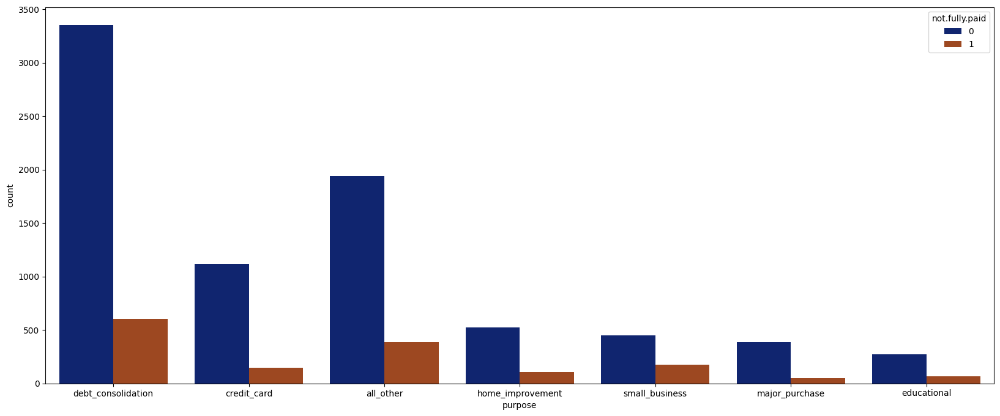

# Random Forest Model vs Decision Tree Classifier on LendingClub Dataset

### Using two Machine Learning Models to predict whether potential debtors will repay their loan based on historical data.
### For this, I will the Decision Tree Classifier, that is as classification model and the Random Forest model, that uses the Emseble Learning technique to compare several small decision trees and chose the best decision.

## 1- Business Problem
Lending Club is America's largest lending marketplace, connecting borrowers with investors since 2007. This company usually shares the dataset of operations history between clients. this data contains several characteristics of the customers who took out a loan, and in the end it shows whether or not there was default ("not.fully.paid").

The main objective of the project is to see which Classification Machine lLearning model behaves best with this dataset, to identify which would make a better prediction of a possible default.
The dataset has information about:

**Credit Policy, Purpose of the loan, Loan Interest Rate, Installment, FICO score, Public Rec, Not Fully Paid and others.**

The complete list is below: 
* credit.policy, int.rate, installment, log.annual.inc, dti, fico, days.with.cr.line, revol.bal, revol.util, inq.last.6mths, delinq.2yrs, pub.rec

## 2 - Tools
- Python
- LendingClub Dataset (2007 - 2010)

## 3- Solution (Step by step)
 **Step I** - Import Libraries;
 
 **Step II** - Load dataset (provided by ASIMOV ACADEMY);
 
 **Step III** - Analyze how the data is distributed;
 
 **Step IV** - Find correlation between the variables .
 
 **Step V** - Implement the Decision Tree Classifier and analyze the Classification Report and Consufion Matrix
 
 **Step VI** - Implement the Random Forest and analyze the Classification Report and Consufion Matrix;
 
 **Step VII** - Compare the two models and see which performed better;
 
 **Step VIII** - Make a conclusion.

## 4- Insights

### **4.1 - Analyzing Data**
- First of all, i used matplotlib to plot a graph and analyze how the defaulted transactions are split between trading purposes.
- Not Fully Paid = 0 (Paid Transactions) and  Not Fully Paid = 1 (Defaulted Transactions)

- Its clear that the amount of Defaulted Transactions is much smaller than the amount of Paid Transactions, and most Paid Transactions are in purpose Debt Consolidation.

### **4.2 - Decision Tree Classifier**

### **3.3 - Random Forest**

### **3.4 - Checking the Coefficients**

## 5- Conclusion

## 6- Next-Steps

**Despite knowing that the project can still be improved a lot, I consider it finished.**

